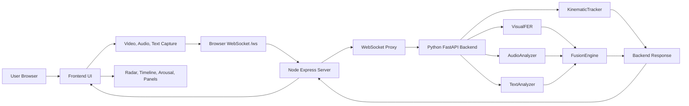
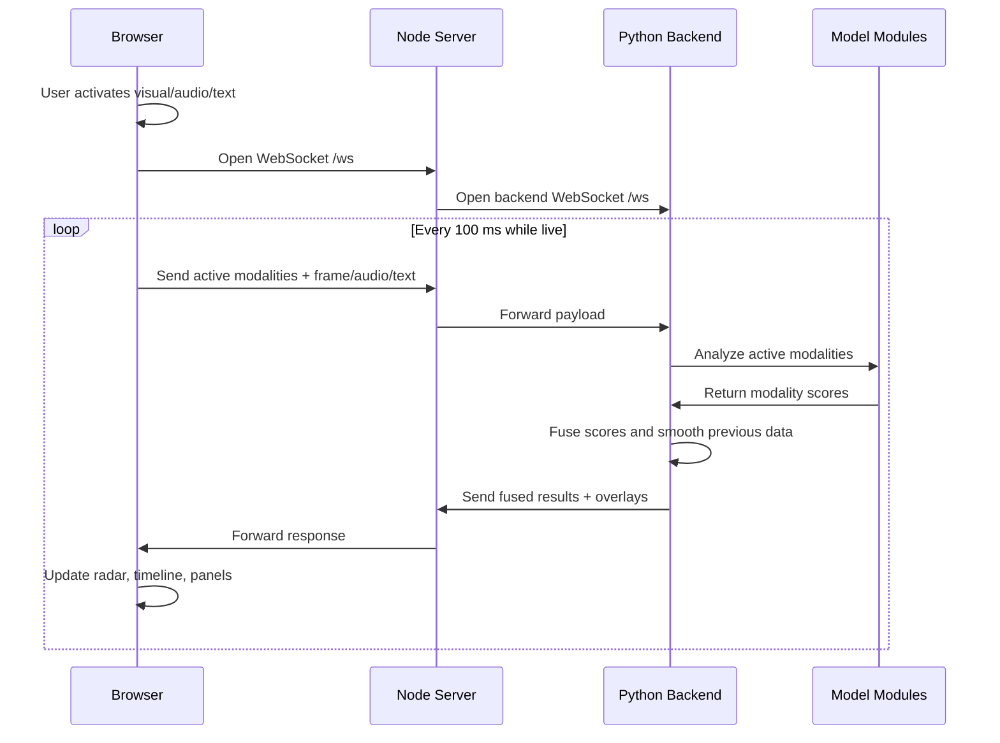
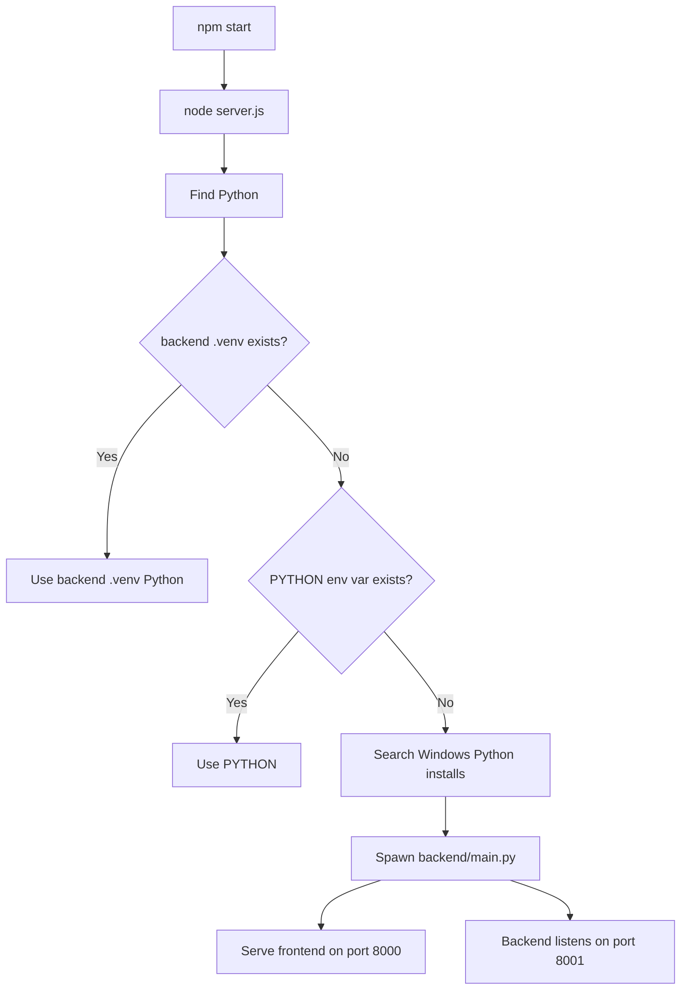

# Architecture and Flowcharts

This document explains how Optimizing Multimodal Emotion Recognition is wired internally.

## High-Level Architecture



## Runtime Components

| Component | File | Responsibility |
| --- | --- | --- |
| Root launcher | `index.js` | Loads `server.js`. |
| Node server | `server.js` | Serves frontend, starts Python, proxies APIs and WebSockets. |
| Browser app | `frontend/js/app.js` | Captures media, sends live payloads, renders charts. |
| Backend app | `backend/main.py` | Receives live payloads, calls models, sends results. |
| Face analyzer | `backend/models/fer_model.py` | Face detection and facial emotion scores. |
| Text analyzer | `backend/models/text_analyzer.py` | Translation, VADER, transformer emotion analysis. |
| Audio analyzer | `backend/models/audio_analyzer.py` | Audio emotion and speaking-rate analysis. |
| Motion tracker | `backend/models/kinematic_tracker.py` | Face landmarks, velocity, acceleration, arousal. |
| Fusion engine | `backend/models/fusion_engine.py` | Weighted late fusion and per-session smoothing. |

## Live Session Flow



## Data Payload

Browser to backend:

```json
{
  "active_modalities": ["visual", "audio", "text"],
  "image": "data:image/jpeg;base64,...",
  "audio": "base64-int16-pcm",
  "text": "I am happy today"
}
```

Backend to browser:

```json
{
  "visual_emotions": {
    "emotions": {"Happy": 0.7, "Neutral": 0.3},
    "face_rect": [120, 80, 180, 180]
  },
  "audio_emotions": {
    "emotions": {"Neutral": 0.5, "Happy": 0.3},
    "speaking_rate": 3.1,
    "energy": 0.08
  },
  "text_emotions": {
    "lexicon": {"Happy": 0.8},
    "transformer": {"Happy": 0.9},
    "detected_language": "te",
    "translated_text": "I am happy"
  },
  "arousal": {
    "arousal": 0.42,
    "velocity": 0.03,
    "acceleration": 0.01,
    "mesh_points": []
  },
  "fused_emotions": {
    "Happy": 0.62,
    "Neutral": 0.28,
    "Sad": 0.03
  }
}
```

## Fusion Logic

`FusionEngine` uses weighted late fusion:

| Modality | Weight |
| --- | ---: |
| Visual | 1.15 |
| Text | 1.00 |
| Audio | 0.90 |

The fused result is normalized to sum to 1.0. A short-term smoothing value reduces jitter between consecutive frames in the same WebSocket session.

## Startup Flow



## API Routes

| Route | Owner | Purpose |
| --- | --- | --- |
| `GET /` | Node | Serves `frontend/index.html`. |
| `GET /health` | Node proxy | Reports frontend and backend health. |
| `GET /languages` | Node proxy | Returns supported language list. |
| `POST /translate` | Node proxy | Translates text through backend service. |
| `POST /generate-seaborn` | Node | Runs Seaborn report worker. |
| `POST /transcribe` | Node | Runs Whisper worker for audio-to-text. |
| `WS /ws` | Node proxy | Live browser-to-backend stream. |
